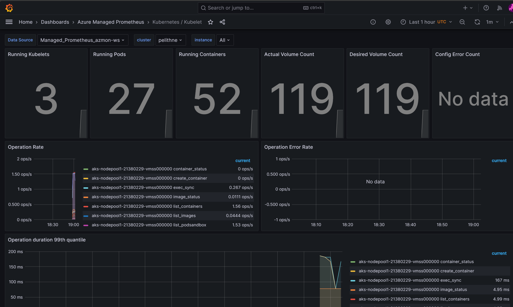

# 7 Monitoring

**In This Article:**

- [7 Monitoring](#7-monitoring)
- [Enable monitoring for Kubernetes clusters](#enable-monitoring-for-kubernetes-clusters)
  - [Enable Prometheus and Grafana](#enable-prometheus-and-grafana)
  - [Create grafana dashboard](#create-grafana-dashboard)
  - [Enable Container insights](#enable-container-insights)
  - [Verify deployment](#verify-deployment)
    - [Managed Prometheus](#managed-prometheus)
    - [Container insights](#container-insights)
  - [Configure data collection in Container insights using ConfigMap](#configure-data-collection-in-container-insights-using-configmap)
    - [TODO](#todo)
  - [Configure syslog and display using grafana](#configure-syslog-and-display-using-grafana)
  - [Query logs from Container insights](#query-logs-from-container-insights)
  - [Create an alert](#create-an-alert)
  - [Experimentation time](#experimentation-time)


Env var

````
HUB_RG=rg-hub
SPOKE_RG=rg-spoke
LOCATION=eastus 
BASTION_NSG_NAME=Bastion_NSG
JUMPBOX_NSG_NAME=Jumpbox_NSG
FW_NAME=azure-firewall
AKS_IDENTITY_NAME=aks-msi
JUMPBOX_VM_NAME=Jumpbox-VM
AKS_CLUSTER_NAME=private-aks
AZ_MON_WORKSPACE=azmon-ws
MANAGED_GRAFANA_NAME=managed-grafana-ws
LOG_ANALYTICS_WORKSPACE=log-analytics-ws

````

# Precondition

Open up FW to allow access to Azure Monitor endpoints. 

# Enable monitoring for Kubernetes clusters

This section describes how to enable monitoring of your Kubernetes clusters using the following Azure Monitor features:

- *Managed Prometheus* for metric collection
- *Container insights* for log collection
- *Managed Grafana* for visualization.

You can enable monitoring in multiple different ways. You can use the Azure Portal, Azure CLI, Azure Resource Manager template, Terraform, or Azure Policy. In this section, we will use Azure CLI, but feel free to learn more. A good place to start is here: https://learn.microsoft.com/en-us/azure/azure-monitor/containers/kubernetes-monitoring-enable 


## Enable Prometheus and Grafana

The only requirement to enable Azure Monitor managed service for Prometheus is to create an Azure Monitor workspace, which is where Prometheus metrics are stored. Once this workspace is created, you can onboard services that collect Prometheus metrics.

```azurecli
az monitor account create --name  $AZ_MON_WORKSPACE --resource-group $SPOKE_RG --location $LOCATION
```

Make a note of the resource id. It should look similar to this ````"/subscriptions/0b6cb75e-8bb1-426b-8c7e-acd7c7599495/resourcegroups/pelithne/providers/microsoft.monitor/accounts/azmon-ws"````

To enable Grafana, you also need to create a Grafana workspace. If you are prompted to install the "amg" extension, just accept that. 

```azurecli
az grafana create --name $MANAGED_GRAFANA_NAME --resource-group $SPOKE_RG
```

Make a note of the resource id. It should look similar to this ````"/subscriptions/0b6cb75e-8bb1-426b-8c7e-acd7c7599495/resourceGroups/pelithne/providers/Microsoft.Dashboard/grafana/managed-grafana-ws"````

Now you can connect the Azure monitor workspace with the Grafana workspace. This will enable you to create Grafana dashboards using data from the Azure monitor workspace, with prometheus metrics enabled.

Use the following example command, but replace with your own information (for example the resource ids created in the previous steps):

```azurecli
 az aks update --enable-azure-monitor-metrics -n $AKS_CLUSTER_NAME -g $SPOKE_RG --azure-monitor-workspace-resource-id "/subscriptions/0b6cb75e-8bb1-426b-8c7e-acd7c7599495/resourcegroups/pelithne/providers/microsoft.monitor/accounts/azmon-ws"  --grafana-resource-id  "/subscriptions/0b6cb75e-8bb1-426b-8c7e-acd7c7599495/resourceGroups/pelithne/providers/Microsoft.Dashboard/grafana/managed-grafana-ws"
 ```


## Verify deployment
Use *kubectl*  to verify that the agent is deployed properly.

### Managed Prometheus

**Verify that the DaemonSet was deployed properly on the Linux node pools**

```bash
kubectl get ds ama-metrics-node --namespace=kube-system
```

The number of pods should be equal to the number of Linux nodes on the cluster. The output should resemble the following example:

```output
User@aksuser:~$ kubectl get ds ama-metrics-node --namespace=kube-system
NAME               DESIRED   CURRENT   READY   UP-TO-DATE   AVAILABLE   NODE SELECTOR   AGE
ama-metrics-node   1         1         1       1            1           <none>          10h
```

**Verify that the two ReplicaSets were deployed for Prometheus**

```bash
kubectl get rs --namespace=kube-system
```

The output should resemble the following example:

```output
User@aksuser:~$kubectl get rs --namespace=kube-system
NAME                            DESIRED   CURRENT   READY   AGE
ama-metrics-5c974985b8          1         1         1       11h
ama-metrics-ksm-5fcf8dffcd      1         1         1       11h
```

## Create grafana dashboard
Go to the "Azure Managed Grafana" resource that was created in your spoke RG. In the blade that opens up, you should see a "Endpoint" that looks similar to this: ```` https://managed-grafana-eqbpc5gdbvh2dub7.eus.grafana.azure.com````

Use the menu (three parallell lines) in the top left of the page, and select "Dashboards".

Expand "Azure Managed Prometheus". These are a number of build it dashboards that comes out of the box. Select e.g. ````Kubernetes / Kubelet````

You should see something similar to this (but dont forget to scroll further down):





## Experimentation time
Use google/copilot/your own imagination to experiment a little bit with some dashboards.


## Enable Container insights

Create a log-analytics workspace

````azurecli
az monitor log-analytics workspace create -g $SPOKE_RG -n $LOG_ANALYTICS_WORKSPACE
````

Make a note of the log-analytics workspace resource ID. It should look similar to ````subscriptions/0b6cb75e-8bb1-426b-8c7e-acd7c7599495/resourceGroups/rg-spoke/providers/Microsoft.OperationalInsights/workspaces/log-analytics-ws/````


Then enable the monitoring add-on for AKS (use the resource ID from above). 

```azurecli
az aks enable-addons -a monitoring -n $AKS_CLUSTER_NAME  -g $SPOKE_RG --workspace-resource-id "subscriptions/0b6cb75e-8bb1-426b-8c7e-acd7c7599495/resourceGroups/rg-spoke/providers/Microsoft.OperationalInsights/workspaces/log-analytics-ws/"
```


## Verify deployment

### Container insights

**Verify that the DaemonSets were deployed properly on the Linux node pools**

```bash
kubectl get ds ama-logs --namespace=kube-system
```

The number of pods should be equal to the number of Linux nodes on the cluster. The output should resemble the following example:

```output
User@aksuser:~$ kubectl get ds ama-logs --namespace=kube-system
NAME       DESIRED   CURRENT   READY     UP-TO-DATE   AVAILABLE   NODE SELECTOR   AGE
ama-logs   2         2         2         2            2           <none>          1d
```


**Verify deployment of the Container insights solution**

```bash
kubectl get deployment ama-logs-rs --namespace=kube-system
```

The output should resemble the following example:

```output
User@aksuser:~$ kubectl get deployment ama-logs-rs --namespace=kube-system
NAME          READY   UP-TO-DATE   AVAILABLE   AGE
ama-logs-rs   1/1     1            1           24d
```

**View configuration with CLI**

Use the `aks show` command to find out whether the solution is enabled, the Log Analytics workspace resource ID, and summary information about the cluster.

```azurecli
az aks show -g $SPOKE_RG -n $AKS_CLUSTER_NAME
```

The command will return JSON-formatted information about the solution. The `addonProfiles` section should include information on the `omsagent` as in the following example:

```output
"addonProfiles": {
    "omsagent": {
        "config": {
            "logAnalyticsWorkspaceResourceID": "/subscriptions/00000000-0000-0000-0000-000000000000/resourcegroups/my-resource-group/providers/microsoft.operationalinsights/workspaces/my-workspace",
            "useAADAuth": "true"
        },
        "enabled": true,
        "identity": null
    },
}
```


## Configure data collection in Container insights using ConfigMap

### TODO 
https://learn.microsoft.com/en-us/azure/azure-monitor/containers/container-insights-data-collection-configmap
use monitoring-comfig-map.yaml

A few examples

| log_collection_settings           | Value                   | Description                                                 | Default value |
| --------                          | --------                | ---------                                                   | ------- |
| [stdout] enabled                  | true/false              | Controls whether stdout container log collection is enabled | true |
| [stdout] exclude_namespaces       | Comma-separated array   | Array of namespaces for which stdout logs won't be collected| ["kube-system","gatekeeper-system"] |
| [stderr] enabled                  | true/false              | Controls whether stderr container log collection is enabled | true |
| [stderr] exclude_namespaces       | Comma-separated array   | Array of namespaces for which stderr logs won't be collected| ["kube-system","gatekeeper-system"] |
| [collect_all_kube_events] enabled | true/false              | Controls whether Kube events of all types are collected. By default, the Kube events with type Normal aren't collected| false |


## Configure syslog and display using grafana

Container Insights offers the ability to collect Syslog events from Linux nodes in your Azure Kubernetes Service (AKS) clusters. This includes the ability to collect logs from control plane components like kubelet. Customers can also use Syslog for monitoring security and health events, typically by ingesting syslog into a SIEM system like Microsoft Sentinel.

https://learn.microsoft.com/en-us/azure/azure-monitor/containers/container-insights-syslog

````
az aks enable-addons -a monitoring --enable-msi-auth-for-monitoring --enable-syslog -g syslog-rg -n existing-cluster
````

## Query logs from Container insights

Container insights collects performance metrics, inventory data, and health state information from container hosts and containers. The data is collected every three minutes and forwarded to the Log Analytics workspace in Azure Monitor where it's available for log queries using Log Analytics in Azure Monitor.

https://learn.microsoft.com/en-us/azure/azure-monitor/containers/container-insights-log-query
https://learn.microsoft.com/en-us/azure/azure-monitor/logs/log-analytics-tutorial


Use "playground" to learn more:
https://portal.azure.com/#view/Microsoft_OperationsManagementSuite_Workspace/LogsDemo.ReactView


## Create an alert


## Experimentation time

Use copilot/google/stack overflow/MS learn to create dashboards in Grafana and Azure Monitor.


//References: https://learn.microsoft.com/en-us/azure/azure-monitor/containers/monitor-kubernetes
