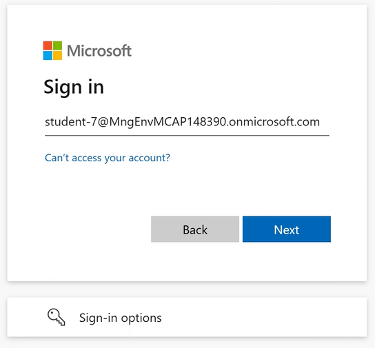
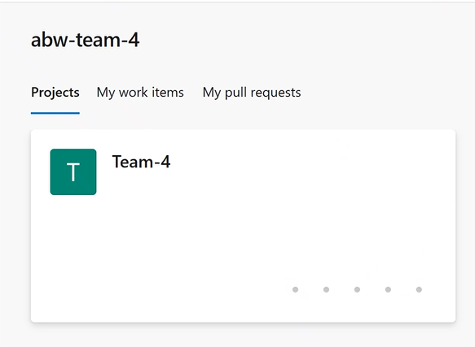
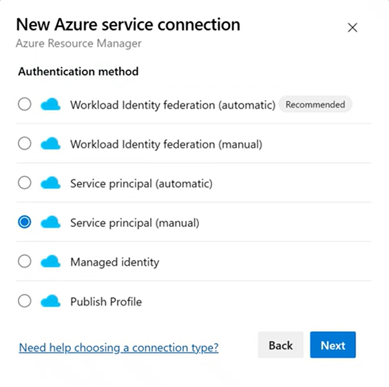
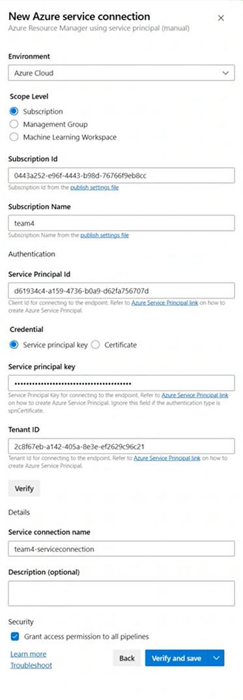
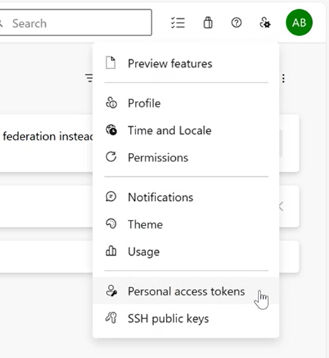

# Automation

**In This Article:**

- [Azure Devops](#Azure Devops)


## Introduction
This section contains instructions about how to automate deployment of the infrastructure for AKS Secure Baseline, using Azure Devops Pipelines and Terraform. The central idea is to have the complete infrastructure defined as code (IaC) and that deployment of that infrastructure can be completely automated using Deployment Pipelines. 


## Terraform
In this repository, there are a number of Terraform templates. You will not use them directly, and instead call them from a pipeline. It is still a good idea to understand the content of the terraform templates. 

In the folder named "Terraform" you will find the main template, aptly named ````main.tf````

This main template is referencing a number of *modules*. The modules in term are responsible for deploying the various Azure resources used in the AKS Secure Baseline. You will see an AKS module, an application_gateway module, a virtual_network module, and so on.

Please take some time to familiarize yourself with the content of the templates. No need to understand everything, but try to get an overview at least.

## Azure Devops

Azure Devops is the tool that will be used to run the templates. In order to do so, you need to go through a couple of steps, which will be detailed further down:

* Login to the Azure Devops organization (we have prepared the organization for you)
* Create a service connection to Azure, to allow the pipeline to interact with Azure and AKS
* Create a self-hosted agent that will run all the tasks in the pipeline (we have prepared this as well)
* Clone repository (this repository) to give Azure Devops access to the Terraform templates, and the preconfigured pipeline definitions (we have prepared this )
* Edit the necessary parameters, and run the pipeline
* Troubleshoot... :-)

### Login to the Azure Devops organization

Login use your azure identity



<br>

When logged in you should see something similar to this:




### Create a service connection to Azure

There are different ways to create a connection from Azure Devops to Azure. One of the common approaches (but not the easiest) is to first create a **Service Principle** in Azure, and give that SP the correct permissions in the subscription. And then as a second step, use that Service Principle in Azure Devops. This is the approach we will have today, because this is most likely how you will have to do it in your real tenant.

Create a Service Principle in Azure, and create a Role Assignment that makes the SP **Owner** in the subscription. First make sure you are logged in to the right subscription with your shell (using local bash or cloudshell or the Jumphost)

````
SP_NAME=<a meaningful name e.g. your team name>
 
# Login to Azure
az login
 
# Create a service principal
sp=$(az ad sp create-for-rbac --name ServicePrincipalName --sdk-auth)
 
 
# Get the subscription id of the subscription id.
subscriptionId=$(az account show --query id -o tsv)
 
# Extract the service principal id from the service principal creation output
spId=$(echo $sp | jq -r .clientId)
 
#Fetch the clientSecret from the output
echo $sp | jq -r .clientSecret
 
# Assign the 'Owner' role to the service principal for the subscription
az role assignment create --assignee $spId --role Owner --scope /subscriptions/$subscriptionId
has context menu

````

Go back to Azure Devops and open up the project called the same thing as your team (we have already created the project for you).

Go to project settings -> service connections 

Choose "Create new service connection" and select **Azure Resource Manager", then select "Service Prinicipal - Manual". 



Fill out the service connection information, using the below image as a template. Use the Service Principal ID and Service Principal Key created in the previous step. 

Give the pipeline a meaningful name and finally check the box named "Grant access permission to all pipelines" and click **Verify and Save**. 





### Create a self-hosted agent
Azure Devops provides "Microsoft hosted agents", but you will instead create a Self hosted agent, that will run on a VM in your subscription in Azure. This is so that the agent is able to access resources in your subscriptions that are isolated inside a VNET (like the Kubernetes API). 

In order to provide the Self-hosted agent access to Azure Devops, we need to create a **Personal Access Token**, a PAT. 

In Azure Devops, click on the user settings icon in the top left corner (icon is a person with a "cog") and select "Personal Access Tokens".



In the next window that appears, select "Create New Token". In the dialogue that appears, set "Scopes" to "Full Access" and give the token a descriptive name. Remember to copy the token, as it will not be retrievable.

Now use **Azure Cloudshell** to create the agent, using Terraform. This involves a few steps:

1. Clone the repository (this repository) to get access to the template used to create the agent. Then cd into the directory with the self-hosted template
````
git clone https://github.com/pelithne/AKS_Baseline_Deepdive.git

cd AKS_Baseline_Deepdive/self-hosted-agent/
````


### Clone repository


### Run the pipeline

